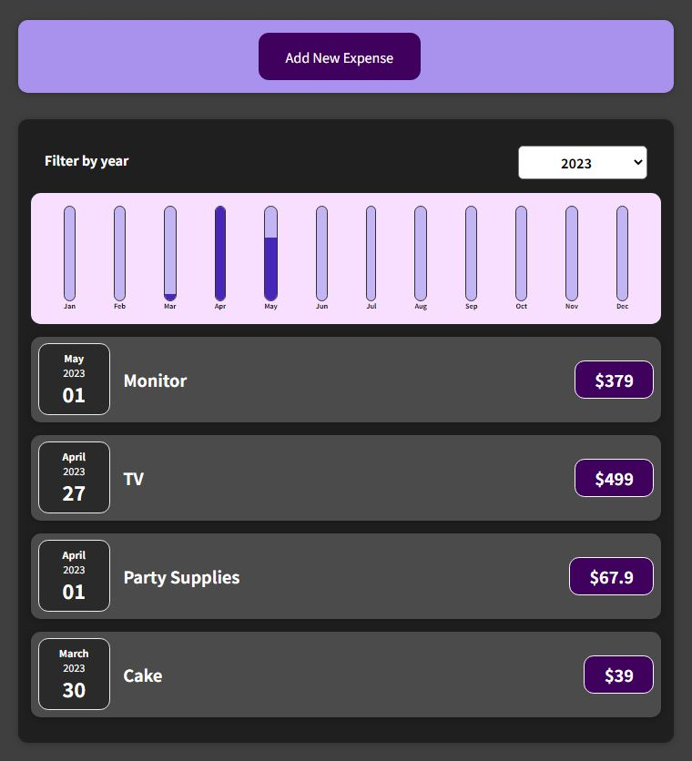

# Expense Tracker

A simple expense tracker to learn the basics of React. From [React - The Complete Guide (incl Hooks, React Router, Redux)](https://www.udemy.com/course/react-the-complete-guide-incl-redux/) by Academind by Maximilian Schwarzmüller.

Current status:

- Completed Section 5, basic functionality implemented.

