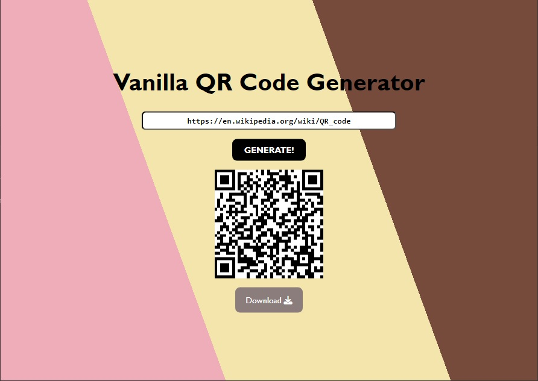

# Vanilla QR Code Generator

Referenced from [@codingrandom](https://www.instagram.com/codingrandom/) on Instagram. This appeared on my Instagram feed so I decided to try it and practice my CSS and JS. 😁

🍦 Built using HTML, CSS, JavaScript, and a yearning for neapolitan ice cream.

